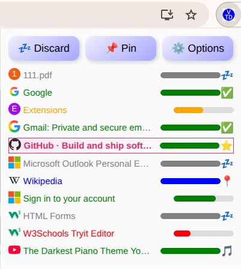

# 💤 Vibed Tab Discarder

[](https://github.com/dolgov/VibedTabDiscarder/actions/workflows/release.yml)
[](https://github.com/dolgov/VibedTabDiscarder/releases)
[](LICENSE)
[](https://developer.chrome.com/docs/extensions/mv3/intro/)
[](https://prettier.io/)

> 🧠 A privacy-respecting Chrome extension that automatically discards inactive tabs using Chrome’s **native discard mechanism** — keeping your browser fast and light without breaking websites. Essentially, a user-friendly Chrome's Memory Saver with controllable timeout and whitelist.

---

## 🚀 Features

### 🧠 Native Tab Discard (not Suspension)

Unlike tab _suspension_, Vibed Tab Discarder uses **only** Chrome’s built-in _discard_ API:
- Tabs are *not replaced* with a fake HTML “suspended” page.
- Chrome’s own tab management handles reloading and memory recovery.

**✅ Pros**
- 100 % compatible with all websites (no injected suspension page)
- No risk of losing tabs if the extension is removed or crashes
- Minimal CPU and memory footprint — relies on Chrome’s memory manager
- Instant tab restoration when clicked

**⚠️ Cons**
- Chrome decides how to reload a discarded tab and may or may not re-requests content
- Background scripts in tabs stop running (by design)
- Cannot animate favicons (more on this below)
- Cannot intercept form submission or scrolling history (since tab is inactive)

---

### 📍 Pin Protection
Click the **📌 Pin / 📍 Unpin** button in the popup to exempt the current tab from auto-discarding.
Pinned tabs remain fully active indefinitely... unless the built-in Chrome's Memory Saver is on and interferes.

---

### ✅ Whitelist Support
You can enter URL fragments (like `youtube.com`, `example.org`) in the **Options** page.
Tabs containing any of these strings are always kept active.

---

### 🎵 Audio-Aware
Tabs that are playing sound are automatically protected. No extra configuration required.

---

### 🧾 No Favicon Animation — Popup List Instead

MV2 allowed one to animate tab favicons when tabs are about to be suspended.
This extension **does not animate** favicons because:

- MV3 restricts favicon modification on many modern sites (causing flicker or errors).
- Animation can increase CPU usage and distract users.
- Instead, Vibed Tab Discarder provides a **popup list** showing all open tabs with live progress bars and indicators.

> The popup UI displays each tab’s title, favicon, time until discard, and indicators like 📍 (pinned), ✅ (whitelisted), 🎵 (audible), 💤 (discarded).



---

### ⚙️ Simple Options Page

Configure:
- Timeout (minutes of inactivity before discard)
- Whitelist (comma-separated URL parts)
- Debug logging toggle

---

### 🧩 Keep in mind: No Form Detection

Some tab suspenders attempt to detect incomplete forms before discarding — but this is **unreliable** especially in MV3 because:
- Chrome extensions **cannot reliably access unsaved form data** without injecting heavy content scripts into every page.
- Some sites use custom input controls that don’t trigger normal DOM events.
- Attempting this would harm privacy and performance.

For these reasons, **Vibed Tab Discarder does not try to detect incomplete forms**.
It favors reliability and user trust over guessing site state.

---

## 🧩 How to Use

1. **Open the popup** from the toolbar icon.
2. The list shows all tabs with:
   - **Progress bars** — time left before discard
   - **Indicators** — 📍 pinned, ✅ whitelisted, 🎵 audible, 💤 discarded
3. Click **📌 Pin / 📍 Unpin** to protect or unprotect the current tab.
4. Use the **Options** button to configure timeout or whitelist.
5. Tabs will automatically discard after your chosen idle period.

---

## ⚙️ Installation

### 🧱 From GitHub Releases (Private Install)
1. Go to the [Releases page](../../releases/latest)
2. Download one of:
   - **`chrome-extension.crx`** → for drag-and-drop install (Developer Mode required)
   - **`chrome-extension.zip`** → for unpacking installation
3. Open `chrome://extensions/`
4. Enable **Developer Mode** (top right)
5. Either:
   - Click **Load unpacked** → select the unzipped folder
   - *or* drag-and-drop the `.crx` file into the page

   
### 🧪 From Source (for developers)
```bash
git clone https://github.com/dolgov/VibedTabDiscarder.git
cd VibedTabDiscarder
```

Then load the folder via **chrome://extensions → Load unpacked**.

## 💡 Architecture Overview

```
├── background.js     # Core logic: timestamps, discard, alarms, skipList
├── popup.html/js     # Popup UI with tab indicators & pin toggle
├── options.html/js   # Settings: timeout, whitelist, debug
├── icons/            # Toolbar icons
├── manifest.json     # Chrome Manifest V3 definition
```

---

## 🔧 Development and Packaging

### Requirements
- Node.js ≥ 18
- Chrome browser (for testing)

### Build locally
```bash
npm install -g crx3
npx crx3 dist --key extension-key.pem --crx chrome-extension.crx
```

---

## 🤝 Contributing

1. Fork the repository
2. Create a feature branch (`git checkout -b feature/new-feature`)
3. Commit and push changes
4. Open a Pull Request

---

## 🪪 License

MIT License © 2025
See [LICENSE](LICENSE) for details.
